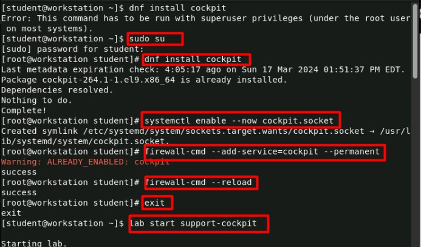
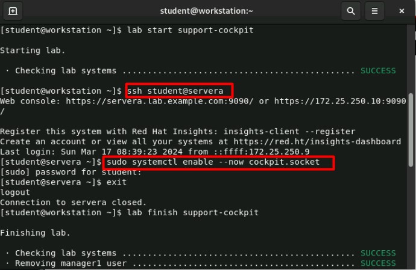
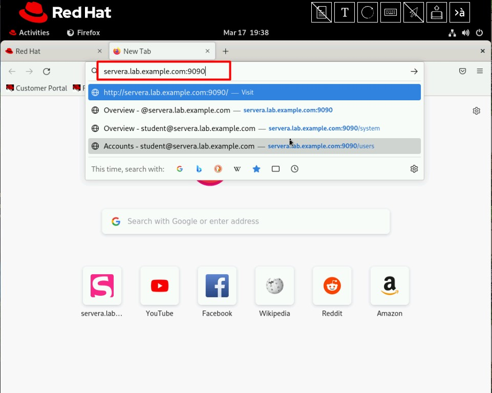
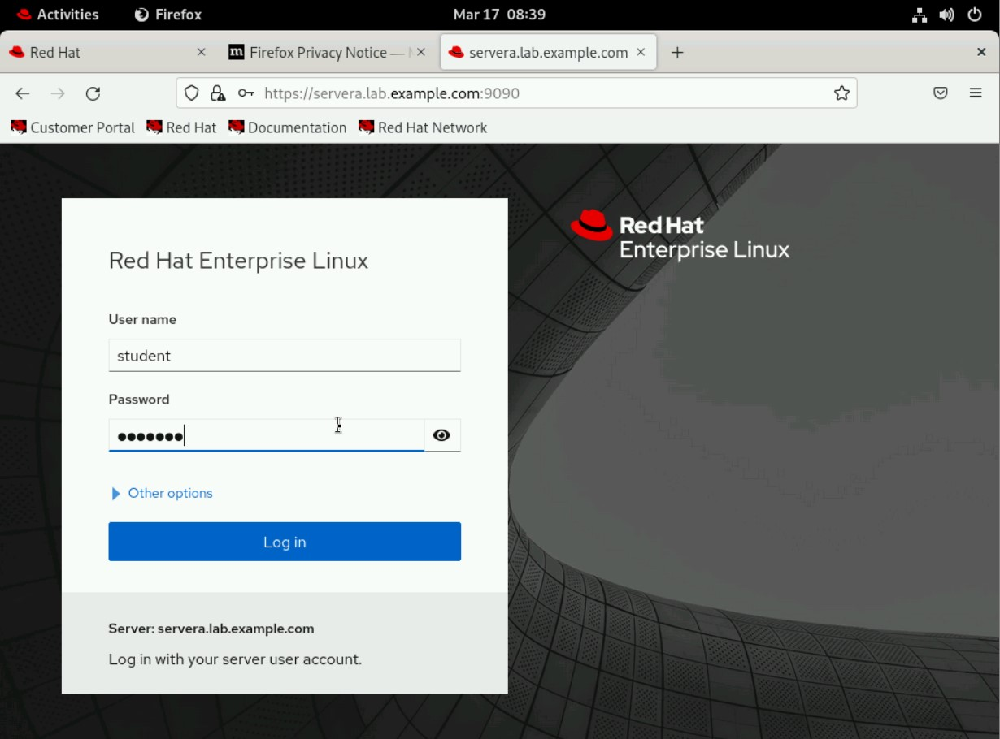
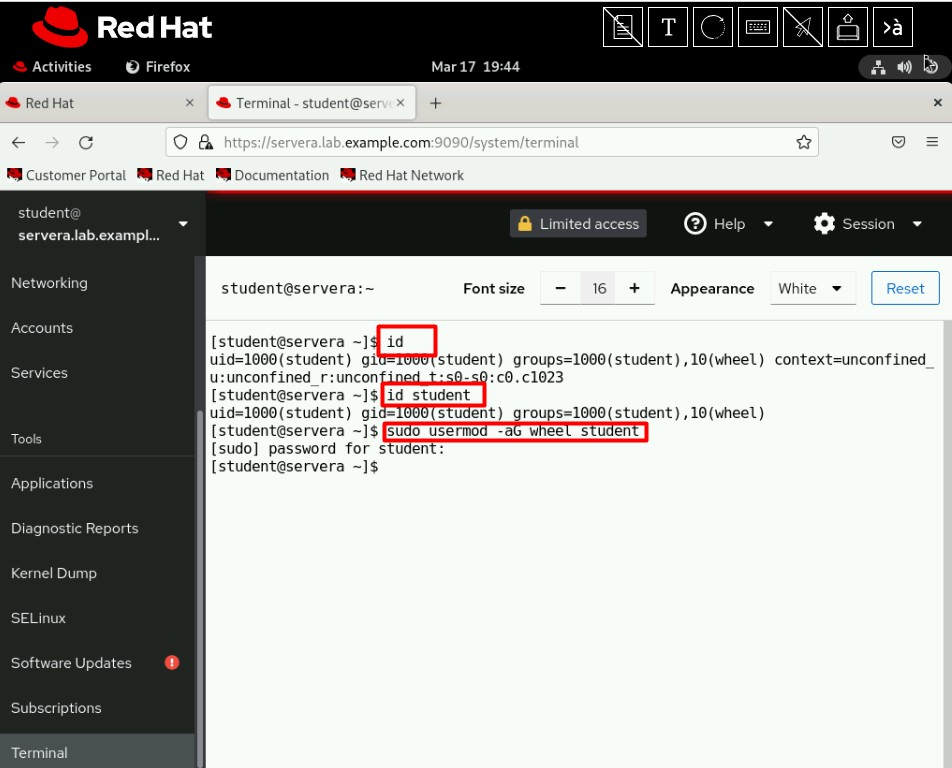
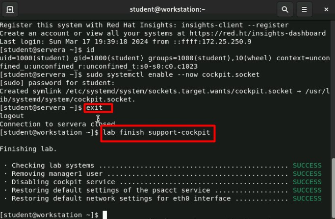

# Analisis Performa Server

#### 1. Konsol web diinstal secara default di semua varian instalasi kecuali dalam instalasi minimal. Kemudian, aktifkan dan mulai `cockpit.socket` layanan yang menjalankan server web. Langkah ini diperlukan jika Anda perlu terhubung ke sistem melalui antarmuka web. Jika Anda menggunakan profil firewall khusus, Anda harus menambahkan `cockpit layanan firewall` untuk membuka port 9090 di firewall

#### 2. Masuk ke servera mesin sebagai student pengguna, dan Aktifkan layanan konsol web.

#### 3. Buka browser dan navigasikan ke https://servera.lab.example.com:9090.

#### 4. Untuk masuk ke konsol web, masukkan nama pengguna dan kata sandi Anda di layar masuk. Anda dapat masuk dengan nama pengguna dan kata sandi akun lokal mana pun di sistem, termasuk root pengguna.

#### 5. Klik tombol Terminal di bilah navigasi kiri untuk mengakses terminal. Sesi terminal terbuka ketika studentpengguna sudah masuk. Verifikasi bahwa eksekusi perintah berfungsi di terminal tertanam. Gunakan `id student` perintah untuk melihat keanggotaan grup pengguna student. Gunakan `sudo usermod -aG wheel student` perintah untuk menambahkan student pengguna ke wheelgrup.

#### 6. Kembali ke workstation sistem sebagai student pengguna. Di workstation mesin, ubah ke student direktori home pengguna dan gunakan lab perintah untuk menyelesaikan latihan ini. Langkah ini penting untuk memastikan bahwa sumber daya dari latihan sebelumnya tidak berdampak pada latihan yang akan datang.

